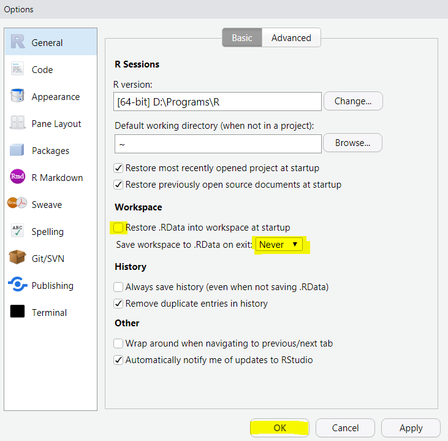
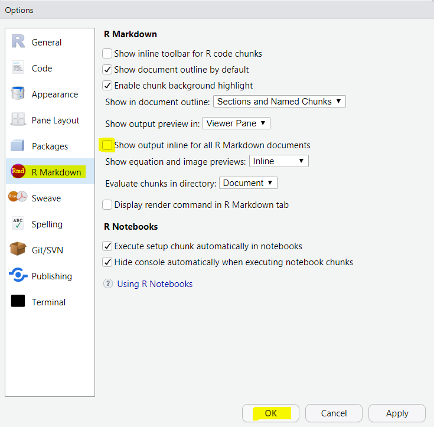
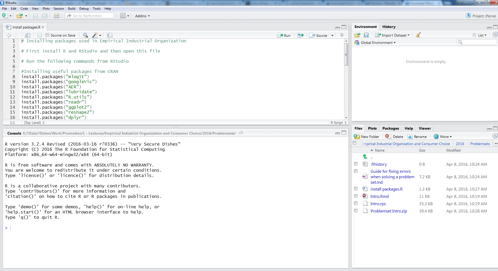
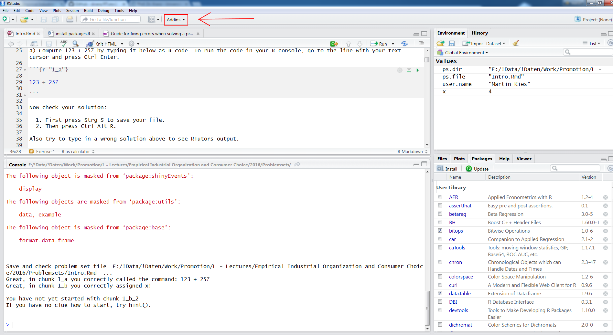

Please follow all steps explained below to setup your RStudio environment for this course and to solve your first RTutor problem set.

# 1 - Install R and RStudio

## 1.1 Install R

Download newest R (base) version from here:

[https://cran.r-project.org/](https://cran.r-project.org/)

Pick your operation system and the the subdirectory `base`. If you have a Windows PC you can directly click here:

[https://cran.r-project.org/bin/windows/base/](https://cran.r-project.org/bin/windows/base/)

The install the downloaded file. You don't need to adapt the default install options.

## 1.2 Install R-Studio

We will not directly start R, but use RStudio instead. Go to the following link to download RStudio onto your laptop and then install it:

[https://www.rstudio.com/products/RStudio/#Desktop](https://www.rstudio.com/products/RStudio/#Desktop)

It is not necessary to check/uncheck special options if you do not want to do so.

# 2. Adapt global options in R Studio

[Click to watch a Youtube video for Step 2](https://youtu.be/YxnFAhVoOHg)

## 2.1 Turn off "Save workspace" (Important!)

You should now definitely set the following options in RStudio to make sure that RTutor does not get caught in a state of perpetual error.

Go in RStudio to the Menu `Tools -> Global Options`. Set the options for "Workspace" as highlightes in yellow in the Screenshot below and then press "Ok".



## 2.2 Optional: Don't show R output inline

Personally I also turn off the default global option to show output of R code inline in RMarkdown documents. I think this makes RTutor problem sets easier to work with, but that is a matter of taste. See the screenshot to turn of that options:




# 3. Install all required R packages for this course

Please, follow this step even if you have already RTutor installed. RTutor is updated almost every semester.

[Click to watch a Youtube video for Step 3](https://youtu.be/OnURITAyP7o)

- Download the file `install_packages.R` from Moodle and open it with R-Studio. (You can just double click on the file in your file browser or choose in RStudio `File -> Open File`)

- You should now see a screen like the following:




- Execute all lines. You may do so by repeatedly pressing CTRL+RETURN or by using the `Run` Button on the top right corner of the top left window. You should do this line by line - in case there are error messages that have to be dealt with. The complete installation may take some while.

## Important for Mac-OS Users: Install xquartz

If you have an Apple computer with Mac-OS, try to run in the R console the command  `library(compareGroups)` after you have installed all packages. If that works without problems, all is fine. Otherwise, please install [https://www.xquartz.org](https://www.xquartz.org). The problem is described [here](https://github.com/isubirana/compareGroups/issues/14). 


# 4. Download and solve the first RTutor problem set 

[Click to watch a Youtube video for Step 4](https://youtu.be/_yUX5erDozQ)

- Create a folder in which you save all your RTutor problem sets of this course, like `C:/courses/empecon/RTutor`. Try to avoid any letters in your path that are not used in the english alphabet (e.g. no `ü` or `ä` or `ß`).

-  Download the first problem set *intro.zip* from Moodle and extract the ZIP it in your problem set directory. If you are a Windows user and don't know how to extract a ZIP file see e.g. the description [here](https://support.microsoft.com/en-us/help/4028088/windows-zip-and-unzip-files).

- Now open the file *intro.Rmd* in RStudio. (You can double click on the file in your file explorer or choose in RStudio the menu entry `File -> Open File`.)


- Set your name in the file by changing the line

```r
user.name = 'ENTER A USER NAME HERE' # set to your user name
```
for example to 

```r
user.name = 'clara_ulmer' # set to your user name
```

Your username should identify you and be the same for each problem set. Again avoid special character like `ü` or `ß`.

- Now scroll down and try to solve the first code chunk:

<pre>
```{r "1_a"}

# enter your code here ...

```
</pre>

Change it to

<pre>
```{r "1_a"} 

123 + 257

```
</pre>

- Now run the Addin `Check Problem Set` (see screenshot below)



- Now continue solving the problem set. Use `Check Problem Set` after each chunk you have worked on. If you have checked a chunk and get an error, you can click on `Addin -> Hint`  or type `hint()` in the R console to get a hint.

- Follow the information at the end of the problem set to make a submission file that you can upload on Moodle.

- If RTutor behaves strangely follow the Guide for fixing errors when solving a problem set that is on Moodle.

# 5 Optional: Adding a shortcut for *Check Problemset*: 

Instead of clicking on the Addin `Check Problemset` you might want to use a shortcut on your keyboard. To add one, follow these steps:


- Open the menu entry `Tools -> Addins -> Browse Addins...`
	
  

- A window opens. Choose the row labelled `R Tutor Check Problemset`  by clicking on it. Then click on the button in the bottom left corner `Keyboard Shortcuts`.

  

- You can now add your preferred keyboard shortcut in the middle column. Just click in the middle column, enter your shortcut like *CTRL + G* and save it. 

- Now every time you want to check your problem set, you just have to press that keyboard shortcut.


